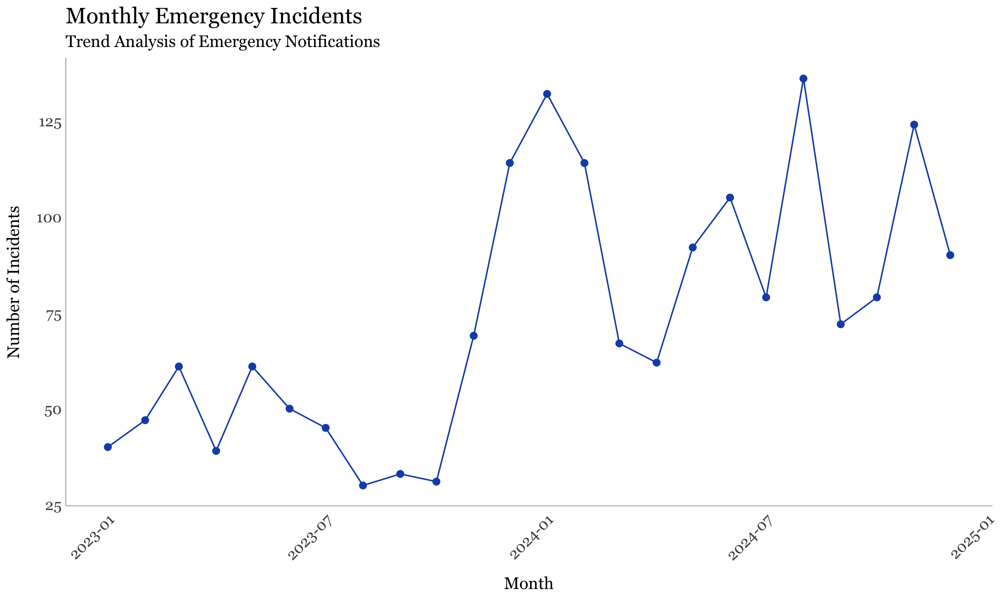
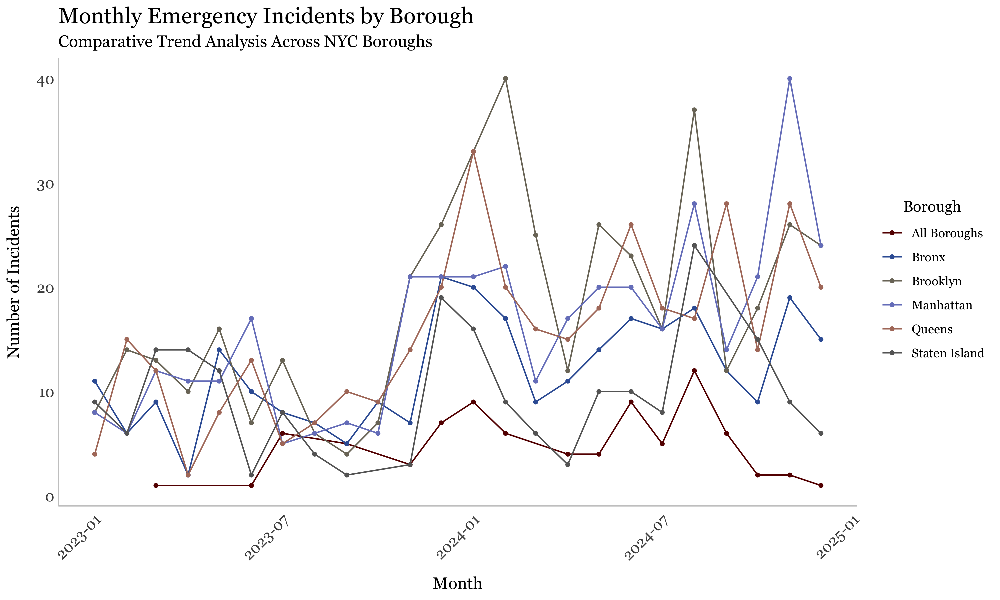

``` r
# Set global chunk options
knitr::opts_chunk$set(
  echo = TRUE,           # Show code chunks in output
  warning = FALSE,       # Don't show warnings
  message = FALSE,       # Don't show messages
  fig.width = 10,        # Default figure width
  fig.height = 6,        # Default figure height
  dpi = 300,             # Figure resolution
  fig.path = "figures/"  # Path to save figures
)
```

## Load Libraries


``` r
library(readxl)
library(writexl)
library(dplyr)
library(tidyr)
library(ggplot2)
library(lubridate)
library(stringr)
library(knitr)
library(kableExtra)
library(councilcount)
library(councildown)
library(councilverse)
```

## Uplaod File


``` r
# Uplaod from Excel
emergency_data <- read_excel("~/Documents/Emergency_Notifs_for_CED/data/output/emergency_data_cleaned.xlsx")
```

## Analysis 1: Top Incident Types


``` r
# Arrange in descending order the most common Incidents
incident_counts <- emergency_data %>%
  count(Incident, sort = TRUE) %>%
  rename(Count = n)

# Create a nice looking table
incident_counts %>%
  kable(col.names = c("Incident Type", "Number of Occurrences"),
        caption = "Frequency of Emergency Incident Types, All Districts") %>%
  kable_styling(bootstrap_options = c("striped", "hover", "condensed", "responsive"),
                full_width = FALSE) %>%
  row_spec(0, bold = TRUE, background = "#f2f2f2") %>%
  row_spec(1:3, background = "#f8f8f8", color = "red")
```

<table class="table table-striped table-hover table-condensed table-responsive" style="width: auto !important; margin-left: auto; margin-right: auto;">
<caption>Frequency of Emergency Incident Types, All Districts</caption>
 <thead>
  <tr>
   <th style="text-align:left;font-weight: bold;background-color: rgba(242, 242, 242, 255) !important;"> Incident Type </th>
   <th style="text-align:right;font-weight: bold;background-color: rgba(242, 242, 242, 255) !important;"> Number of Occurrences </th>
  </tr>
 </thead>
<tbody>
  <tr>
   <td style="text-align:left;color: red !important;background-color: rgba(248, 248, 248, 255) !important;"> Fire </td>
   <td style="text-align:right;color: red !important;background-color: rgba(248, 248, 248, 255) !important;"> 625 </td>
  </tr>
  <tr>
   <td style="text-align:left;color: red !important;background-color: rgba(248, 248, 248, 255) !important;"> Other - Include in Notes </td>
   <td style="text-align:right;color: red !important;background-color: rgba(248, 248, 248, 255) !important;"> 534 </td>
  </tr>
  <tr>
   <td style="text-align:left;color: red !important;background-color: rgba(248, 248, 248, 255) !important;"> Power outage </td>
   <td style="text-align:right;color: red !important;background-color: rgba(248, 248, 248, 255) !important;"> 222 </td>
  </tr>
  <tr>
   <td style="text-align:left;"> Mass Transit </td>
   <td style="text-align:right;"> 138 </td>
  </tr>
  <tr>
   <td style="text-align:left;"> Water condition </td>
   <td style="text-align:right;"> 102 </td>
  </tr>
  <tr>
   <td style="text-align:left;"> Weather related </td>
   <td style="text-align:right;"> 85 </td>
  </tr>
  <tr>
   <td style="text-align:left;"> Construction accident </td>
   <td style="text-align:right;"> 62 </td>
  </tr>
  <tr>
   <td style="text-align:left;"> Building explosion </td>
   <td style="text-align:right;"> 4 </td>
  </tr>
</tbody>
</table>

## Analysis 2: Top 3 Incident Types by District


``` r
# Arrange in descending order top incident types by council district
top_incidents_by_district <- emergency_data %>%
  group_by(Council_District, Incident) %>%
  summarize(Count = n(), .groups = "drop") %>%
  group_by(Council_District) %>%
  arrange(desc(Count)) %>%
  slice_head(n = 3) %>%
  ungroup()

# Create a custom sorting function for districts
district_order <- function(x) {
  # Convert district to character if it's not already
  x <- as.character(x)
  # Create a numeric value for sorting
  ifelse(x == "All Districts", 100, # Put "All Districts" at the end
         ifelse(grepl("^\\d+$", x), as.numeric(x), 99)) # Convert numeric districts to numbers, others to 99
}

# Sort the data by district using the custom function
top_incidents_by_district <- top_incidents_by_district %>%
  mutate(sort_order = district_order(Council_District)) %>%
  arrange(sort_order) %>%
  select(-sort_order)

# Create a nice looking table without group_rows which is causing the error
top_incidents_by_district %>%
  kable(col.names = c("Council District", "Incident Type", "Frequency"),
        caption = "Top 3 Emergency Incident Types by Council District") %>%
  kable_styling(bootstrap_options = c("striped", "hover", "condensed", "responsive"),
                full_width = FALSE) %>%
  row_spec(0, bold = TRUE, background = "#f2f2f2") %>%
  # Add alternating background color for different districts
  row_spec(which(duplicated(top_incidents_by_district$Council_District) == FALSE), 
           extra_css = "border-top: 2px solid #666;") %>%
  footnote(general = "Note: Only top 3 incidents shown per district", 
           general_title = "",
           footnote_as_chunk = TRUE)
```

<table class="table table-striped table-hover table-condensed table-responsive" style="width: auto !important; margin-left: auto; margin-right: auto;border-bottom: 0;">
<caption>Top 3 Emergency Incident Types by Council District</caption>
 <thead>
  <tr>
   <th style="text-align:left;font-weight: bold;background-color: rgba(242, 242, 242, 255) !important;"> Council District </th>
   <th style="text-align:left;font-weight: bold;background-color: rgba(242, 242, 242, 255) !important;"> Incident Type </th>
   <th style="text-align:right;font-weight: bold;background-color: rgba(242, 242, 242, 255) !important;"> Frequency </th>
  </tr>
 </thead>
<tbody>
  <tr>
   <td style="text-align:left;border-top: 2px solid #666;"> 1 </td>
   <td style="text-align:left;border-top: 2px solid #666;"> Fire </td>
   <td style="text-align:right;border-top: 2px solid #666;"> 24 </td>
  </tr>
  <tr>
   <td style="text-align:left;"> 1 </td>
   <td style="text-align:left;"> Other - Include in Notes </td>
   <td style="text-align:right;"> 21 </td>
  </tr>
  <tr>
   <td style="text-align:left;"> 1 </td>
   <td style="text-align:left;"> Construction accident </td>
   <td style="text-align:right;"> 7 </td>
  </tr>
  <tr>
   <td style="text-align:left;border-top: 2px solid #666;"> 2 </td>
   <td style="text-align:left;border-top: 2px solid #666;"> Other - Include in Notes </td>
   <td style="text-align:right;border-top: 2px solid #666;"> 12 </td>
  </tr>
  <tr>
   <td style="text-align:left;"> 2 </td>
   <td style="text-align:left;"> Fire </td>
   <td style="text-align:right;"> 7 </td>
  </tr>
  <tr>
   <td style="text-align:left;"> 2 </td>
   <td style="text-align:left;"> Power outage </td>
   <td style="text-align:right;"> 2 </td>
  </tr>
  <tr>
   <td style="text-align:left;border-top: 2px solid #666;"> 3 </td>
   <td style="text-align:left;border-top: 2px solid #666;"> Fire </td>
   <td style="text-align:right;border-top: 2px solid #666;"> 30 </td>
  </tr>
  <tr>
   <td style="text-align:left;"> 3 </td>
   <td style="text-align:left;"> Other - Include in Notes </td>
   <td style="text-align:right;"> 15 </td>
  </tr>
  <tr>
   <td style="text-align:left;"> 3 </td>
   <td style="text-align:left;"> Water condition </td>
   <td style="text-align:right;"> 5 </td>
  </tr>
  <tr>
   <td style="text-align:left;border-top: 2px solid #666;"> 4 </td>
   <td style="text-align:left;border-top: 2px solid #666;"> Other - Include in Notes </td>
   <td style="text-align:right;border-top: 2px solid #666;"> 24 </td>
  </tr>
  <tr>
   <td style="text-align:left;"> 4 </td>
   <td style="text-align:left;"> Fire </td>
   <td style="text-align:right;"> 23 </td>
  </tr>
  <tr>
   <td style="text-align:left;"> 4 </td>
   <td style="text-align:left;"> Water condition </td>
   <td style="text-align:right;"> 12 </td>
  </tr>
  <tr>
   <td style="text-align:left;border-top: 2px solid #666;"> 5 </td>
   <td style="text-align:left;border-top: 2px solid #666;"> Other - Include in Notes </td>
   <td style="text-align:right;border-top: 2px solid #666;"> 10 </td>
  </tr>
  <tr>
   <td style="text-align:left;"> 5 </td>
   <td style="text-align:left;"> Fire </td>
   <td style="text-align:right;"> 9 </td>
  </tr>
  <tr>
   <td style="text-align:left;"> 5 </td>
   <td style="text-align:left;"> Water condition </td>
   <td style="text-align:right;"> 5 </td>
  </tr>
  <tr>
   <td style="text-align:left;border-top: 2px solid #666;"> 6 </td>
   <td style="text-align:left;border-top: 2px solid #666;"> Fire </td>
   <td style="text-align:right;border-top: 2px solid #666;"> 15 </td>
  </tr>
  <tr>
   <td style="text-align:left;"> 6 </td>
   <td style="text-align:left;"> Other - Include in Notes </td>
   <td style="text-align:right;"> 2 </td>
  </tr>
  <tr>
   <td style="text-align:left;"> 6 </td>
   <td style="text-align:left;"> Water condition </td>
   <td style="text-align:right;"> 2 </td>
  </tr>
  <tr>
   <td style="text-align:left;border-top: 2px solid #666;"> 7 </td>
   <td style="text-align:left;border-top: 2px solid #666;"> Fire </td>
   <td style="text-align:right;border-top: 2px solid #666;"> 18 </td>
  </tr>
  <tr>
   <td style="text-align:left;"> 7 </td>
   <td style="text-align:left;"> Other - Include in Notes </td>
   <td style="text-align:right;"> 6 </td>
  </tr>
  <tr>
   <td style="text-align:left;"> 7 </td>
   <td style="text-align:left;"> Water condition </td>
   <td style="text-align:right;"> 2 </td>
  </tr>
  <tr>
   <td style="text-align:left;border-top: 2px solid #666;"> 8 </td>
   <td style="text-align:left;border-top: 2px solid #666;"> Fire </td>
   <td style="text-align:right;border-top: 2px solid #666;"> 56 </td>
  </tr>
  <tr>
   <td style="text-align:left;"> 8 </td>
   <td style="text-align:left;"> Other - Include in Notes </td>
   <td style="text-align:right;"> 14 </td>
  </tr>
  <tr>
   <td style="text-align:left;"> 8 </td>
   <td style="text-align:left;"> Power outage </td>
   <td style="text-align:right;"> 4 </td>
  </tr>
  <tr>
   <td style="text-align:left;border-top: 2px solid #666;"> 9 </td>
   <td style="text-align:left;border-top: 2px solid #666;"> Fire </td>
   <td style="text-align:right;border-top: 2px solid #666;"> 19 </td>
  </tr>
  <tr>
   <td style="text-align:left;"> 9 </td>
   <td style="text-align:left;"> Other - Include in Notes </td>
   <td style="text-align:right;"> 7 </td>
  </tr>
  <tr>
   <td style="text-align:left;"> 9 </td>
   <td style="text-align:left;"> Water condition </td>
   <td style="text-align:right;"> 3 </td>
  </tr>
  <tr>
   <td style="text-align:left;border-top: 2px solid #666;"> 10 </td>
   <td style="text-align:left;border-top: 2px solid #666;"> Fire </td>
   <td style="text-align:right;border-top: 2px solid #666;"> 16 </td>
  </tr>
  <tr>
   <td style="text-align:left;"> 10 </td>
   <td style="text-align:left;"> Other - Include in Notes </td>
   <td style="text-align:right;"> 7 </td>
  </tr>
  <tr>
   <td style="text-align:left;"> 10 </td>
   <td style="text-align:left;"> Construction accident </td>
   <td style="text-align:right;"> 2 </td>
  </tr>
  <tr>
   <td style="text-align:left;border-top: 2px solid #666;"> 11 </td>
   <td style="text-align:left;border-top: 2px solid #666;"> Fire </td>
   <td style="text-align:right;border-top: 2px solid #666;"> 18 </td>
  </tr>
  <tr>
   <td style="text-align:left;"> 11 </td>
   <td style="text-align:left;"> Other - Include in Notes </td>
   <td style="text-align:right;"> 11 </td>
  </tr>
  <tr>
   <td style="text-align:left;"> 11 </td>
   <td style="text-align:left;"> Water condition </td>
   <td style="text-align:right;"> 6 </td>
  </tr>
  <tr>
   <td style="text-align:left;border-top: 2px solid #666;"> 12 </td>
   <td style="text-align:left;border-top: 2px solid #666;"> Power outage </td>
   <td style="text-align:right;border-top: 2px solid #666;"> 8 </td>
  </tr>
  <tr>
   <td style="text-align:left;"> 12 </td>
   <td style="text-align:left;"> Fire </td>
   <td style="text-align:right;"> 7 </td>
  </tr>
  <tr>
   <td style="text-align:left;"> 12 </td>
   <td style="text-align:left;"> Other - Include in Notes </td>
   <td style="text-align:right;"> 4 </td>
  </tr>
  <tr>
   <td style="text-align:left;border-top: 2px solid #666;"> 13 </td>
   <td style="text-align:left;border-top: 2px solid #666;"> Power outage </td>
   <td style="text-align:right;border-top: 2px solid #666;"> 9 </td>
  </tr>
  <tr>
   <td style="text-align:left;"> 13 </td>
   <td style="text-align:left;"> Fire </td>
   <td style="text-align:right;"> 8 </td>
  </tr>
  <tr>
   <td style="text-align:left;"> 13 </td>
   <td style="text-align:left;"> Other - Include in Notes </td>
   <td style="text-align:right;"> 7 </td>
  </tr>
  <tr>
   <td style="text-align:left;border-top: 2px solid #666;"> 14 </td>
   <td style="text-align:left;border-top: 2px solid #666;"> Fire </td>
   <td style="text-align:right;border-top: 2px solid #666;"> 21 </td>
  </tr>
  <tr>
   <td style="text-align:left;"> 14 </td>
   <td style="text-align:left;"> Other - Include in Notes </td>
   <td style="text-align:right;"> 13 </td>
  </tr>
  <tr>
   <td style="text-align:left;"> 14 </td>
   <td style="text-align:left;"> Construction accident </td>
   <td style="text-align:right;"> 6 </td>
  </tr>
  <tr>
   <td style="text-align:left;border-top: 2px solid #666;"> 15 </td>
   <td style="text-align:left;border-top: 2px solid #666;"> Fire </td>
   <td style="text-align:right;border-top: 2px solid #666;"> 19 </td>
  </tr>
  <tr>
   <td style="text-align:left;"> 15 </td>
   <td style="text-align:left;"> Other - Include in Notes </td>
   <td style="text-align:right;"> 11 </td>
  </tr>
  <tr>
   <td style="text-align:left;"> 15 </td>
   <td style="text-align:left;"> Construction accident </td>
   <td style="text-align:right;"> 1 </td>
  </tr>
  <tr>
   <td style="text-align:left;border-top: 2px solid #666;"> 16 </td>
   <td style="text-align:left;border-top: 2px solid #666;"> Fire </td>
   <td style="text-align:right;border-top: 2px solid #666;"> 14 </td>
  </tr>
  <tr>
   <td style="text-align:left;"> 16 </td>
   <td style="text-align:left;"> Other - Include in Notes </td>
   <td style="text-align:right;"> 8 </td>
  </tr>
  <tr>
   <td style="text-align:left;"> 16 </td>
   <td style="text-align:left;"> Power outage </td>
   <td style="text-align:right;"> 3 </td>
  </tr>
  <tr>
   <td style="text-align:left;border-top: 2px solid #666;"> 17 </td>
   <td style="text-align:left;border-top: 2px solid #666;"> Fire </td>
   <td style="text-align:right;border-top: 2px solid #666;"> 11 </td>
  </tr>
  <tr>
   <td style="text-align:left;"> 17 </td>
   <td style="text-align:left;"> Other - Include in Notes </td>
   <td style="text-align:right;"> 7 </td>
  </tr>
  <tr>
   <td style="text-align:left;"> 17 </td>
   <td style="text-align:left;"> Water condition </td>
   <td style="text-align:right;"> 2 </td>
  </tr>
  <tr>
   <td style="text-align:left;border-top: 2px solid #666;"> 18 </td>
   <td style="text-align:left;border-top: 2px solid #666;"> Fire </td>
   <td style="text-align:right;border-top: 2px solid #666;"> 17 </td>
  </tr>
  <tr>
   <td style="text-align:left;"> 18 </td>
   <td style="text-align:left;"> Power outage </td>
   <td style="text-align:right;"> 5 </td>
  </tr>
  <tr>
   <td style="text-align:left;"> 18 </td>
   <td style="text-align:left;"> Other - Include in Notes </td>
   <td style="text-align:right;"> 3 </td>
  </tr>
  <tr>
   <td style="text-align:left;border-top: 2px solid #666;"> 19 </td>
   <td style="text-align:left;border-top: 2px solid #666;"> Other - Include in Notes </td>
   <td style="text-align:right;border-top: 2px solid #666;"> 8 </td>
  </tr>
  <tr>
   <td style="text-align:left;"> 19 </td>
   <td style="text-align:left;"> Power outage </td>
   <td style="text-align:right;"> 7 </td>
  </tr>
  <tr>
   <td style="text-align:left;"> 19 </td>
   <td style="text-align:left;"> Fire </td>
   <td style="text-align:right;"> 5 </td>
  </tr>
  <tr>
   <td style="text-align:left;border-top: 2px solid #666;"> 20 </td>
   <td style="text-align:left;border-top: 2px solid #666;"> Fire </td>
   <td style="text-align:right;border-top: 2px solid #666;"> 7 </td>
  </tr>
  <tr>
   <td style="text-align:left;"> 20 </td>
   <td style="text-align:left;"> Other - Include in Notes </td>
   <td style="text-align:right;"> 7 </td>
  </tr>
  <tr>
   <td style="text-align:left;"> 20 </td>
   <td style="text-align:left;"> Power outage </td>
   <td style="text-align:right;"> 6 </td>
  </tr>
  <tr>
   <td style="text-align:left;border-top: 2px solid #666;"> 21 </td>
   <td style="text-align:left;border-top: 2px solid #666;"> Other - Include in Notes </td>
   <td style="text-align:right;border-top: 2px solid #666;"> 6 </td>
  </tr>
  <tr>
   <td style="text-align:left;"> 21 </td>
   <td style="text-align:left;"> Power outage </td>
   <td style="text-align:right;"> 3 </td>
  </tr>
  <tr>
   <td style="text-align:left;"> 21 </td>
   <td style="text-align:left;"> Fire </td>
   <td style="text-align:right;"> 2 </td>
  </tr>
  <tr>
   <td style="text-align:left;border-top: 2px solid #666;"> 22 </td>
   <td style="text-align:left;border-top: 2px solid #666;"> Other - Include in Notes </td>
   <td style="text-align:right;border-top: 2px solid #666;"> 5 </td>
  </tr>
  <tr>
   <td style="text-align:left;"> 22 </td>
   <td style="text-align:left;"> Construction accident </td>
   <td style="text-align:right;"> 2 </td>
  </tr>
  <tr>
   <td style="text-align:left;"> 22 </td>
   <td style="text-align:left;"> Fire </td>
   <td style="text-align:right;"> 2 </td>
  </tr>
  <tr>
   <td style="text-align:left;border-top: 2px solid #666;"> 23 </td>
   <td style="text-align:left;border-top: 2px solid #666;"> Other - Include in Notes </td>
   <td style="text-align:right;border-top: 2px solid #666;"> 14 </td>
  </tr>
  <tr>
   <td style="text-align:left;"> 23 </td>
   <td style="text-align:left;"> Fire </td>
   <td style="text-align:right;"> 8 </td>
  </tr>
  <tr>
   <td style="text-align:left;"> 23 </td>
   <td style="text-align:left;"> Power outage </td>
   <td style="text-align:right;"> 8 </td>
  </tr>
  <tr>
   <td style="text-align:left;border-top: 2px solid #666;"> 24 </td>
   <td style="text-align:left;border-top: 2px solid #666;"> Other - Include in Notes </td>
   <td style="text-align:right;border-top: 2px solid #666;"> 7 </td>
  </tr>
  <tr>
   <td style="text-align:left;"> 24 </td>
   <td style="text-align:left;"> Fire </td>
   <td style="text-align:right;"> 5 </td>
  </tr>
  <tr>
   <td style="text-align:left;"> 24 </td>
   <td style="text-align:left;"> Power outage </td>
   <td style="text-align:right;"> 4 </td>
  </tr>
  <tr>
   <td style="text-align:left;border-top: 2px solid #666;"> 25 </td>
   <td style="text-align:left;border-top: 2px solid #666;"> Other - Include in Notes </td>
   <td style="text-align:right;border-top: 2px solid #666;"> 3 </td>
  </tr>
  <tr>
   <td style="text-align:left;"> 25 </td>
   <td style="text-align:left;"> Fire </td>
   <td style="text-align:right;"> 2 </td>
  </tr>
  <tr>
   <td style="text-align:left;border-top: 2px solid #666;"> 26 </td>
   <td style="text-align:left;border-top: 2px solid #666;"> Fire </td>
   <td style="text-align:right;border-top: 2px solid #666;"> 11 </td>
  </tr>
  <tr>
   <td style="text-align:left;"> 26 </td>
   <td style="text-align:left;"> Other - Include in Notes </td>
   <td style="text-align:right;"> 9 </td>
  </tr>
  <tr>
   <td style="text-align:left;"> 26 </td>
   <td style="text-align:left;"> Water condition </td>
   <td style="text-align:right;"> 4 </td>
  </tr>
  <tr>
   <td style="text-align:left;border-top: 2px solid #666;"> 27 </td>
   <td style="text-align:left;border-top: 2px solid #666;"> Other - Include in Notes </td>
   <td style="text-align:right;border-top: 2px solid #666;"> 15 </td>
  </tr>
  <tr>
   <td style="text-align:left;"> 27 </td>
   <td style="text-align:left;"> Fire </td>
   <td style="text-align:right;"> 11 </td>
  </tr>
  <tr>
   <td style="text-align:left;"> 27 </td>
   <td style="text-align:left;"> Power outage </td>
   <td style="text-align:right;"> 5 </td>
  </tr>
  <tr>
   <td style="text-align:left;border-top: 2px solid #666;"> 28 </td>
   <td style="text-align:left;border-top: 2px solid #666;"> Other - Include in Notes </td>
   <td style="text-align:right;border-top: 2px solid #666;"> 12 </td>
  </tr>
  <tr>
   <td style="text-align:left;"> 28 </td>
   <td style="text-align:left;"> Fire </td>
   <td style="text-align:right;"> 10 </td>
  </tr>
  <tr>
   <td style="text-align:left;"> 28 </td>
   <td style="text-align:left;"> Power outage </td>
   <td style="text-align:right;"> 5 </td>
  </tr>
  <tr>
   <td style="text-align:left;border-top: 2px solid #666;"> 29 </td>
   <td style="text-align:left;border-top: 2px solid #666;"> Fire </td>
   <td style="text-align:right;border-top: 2px solid #666;"> 9 </td>
  </tr>
  <tr>
   <td style="text-align:left;"> 29 </td>
   <td style="text-align:left;"> Other - Include in Notes </td>
   <td style="text-align:right;"> 8 </td>
  </tr>
  <tr>
   <td style="text-align:left;"> 29 </td>
   <td style="text-align:left;"> Power outage </td>
   <td style="text-align:right;"> 3 </td>
  </tr>
  <tr>
   <td style="text-align:left;border-top: 2px solid #666;"> 30 </td>
   <td style="text-align:left;border-top: 2px solid #666;"> Power outage </td>
   <td style="text-align:right;border-top: 2px solid #666;"> 9 </td>
  </tr>
  <tr>
   <td style="text-align:left;"> 30 </td>
   <td style="text-align:left;"> Fire </td>
   <td style="text-align:right;"> 5 </td>
  </tr>
  <tr>
   <td style="text-align:left;"> 30 </td>
   <td style="text-align:left;"> Other - Include in Notes </td>
   <td style="text-align:right;"> 3 </td>
  </tr>
  <tr>
   <td style="text-align:left;border-top: 2px solid #666;"> 31 </td>
   <td style="text-align:left;border-top: 2px solid #666;"> Other - Include in Notes </td>
   <td style="text-align:right;border-top: 2px solid #666;"> 12 </td>
  </tr>
  <tr>
   <td style="text-align:left;"> 31 </td>
   <td style="text-align:left;"> Power outage </td>
   <td style="text-align:right;"> 8 </td>
  </tr>
  <tr>
   <td style="text-align:left;"> 31 </td>
   <td style="text-align:left;"> Fire </td>
   <td style="text-align:right;"> 7 </td>
  </tr>
  <tr>
   <td style="text-align:left;border-top: 2px solid #666;"> 32 </td>
   <td style="text-align:left;border-top: 2px solid #666;"> Other - Include in Notes </td>
   <td style="text-align:right;border-top: 2px solid #666;"> 11 </td>
  </tr>
  <tr>
   <td style="text-align:left;"> 32 </td>
   <td style="text-align:left;"> Fire </td>
   <td style="text-align:right;"> 8 </td>
  </tr>
  <tr>
   <td style="text-align:left;"> 32 </td>
   <td style="text-align:left;"> Mass Transit </td>
   <td style="text-align:right;"> 4 </td>
  </tr>
  <tr>
   <td style="text-align:left;border-top: 2px solid #666;"> 33 </td>
   <td style="text-align:left;border-top: 2px solid #666;"> Other - Include in Notes </td>
   <td style="text-align:right;border-top: 2px solid #666;"> 7 </td>
  </tr>
  <tr>
   <td style="text-align:left;"> 33 </td>
   <td style="text-align:left;"> Fire </td>
   <td style="text-align:right;"> 5 </td>
  </tr>
  <tr>
   <td style="text-align:left;"> 33 </td>
   <td style="text-align:left;"> Construction accident </td>
   <td style="text-align:right;"> 3 </td>
  </tr>
  <tr>
   <td style="text-align:left;border-top: 2px solid #666;"> 34 </td>
   <td style="text-align:left;border-top: 2px solid #666;"> Fire </td>
   <td style="text-align:right;border-top: 2px solid #666;"> 24 </td>
  </tr>
  <tr>
   <td style="text-align:left;"> 34 </td>
   <td style="text-align:left;"> Other - Include in Notes </td>
   <td style="text-align:right;"> 24 </td>
  </tr>
  <tr>
   <td style="text-align:left;"> 34 </td>
   <td style="text-align:left;"> Power outage </td>
   <td style="text-align:right;"> 8 </td>
  </tr>
  <tr>
   <td style="text-align:left;border-top: 2px solid #666;"> 35 </td>
   <td style="text-align:left;border-top: 2px solid #666;"> Fire </td>
   <td style="text-align:right;border-top: 2px solid #666;"> 11 </td>
  </tr>
  <tr>
   <td style="text-align:left;"> 35 </td>
   <td style="text-align:left;"> Other - Include in Notes </td>
   <td style="text-align:right;"> 9 </td>
  </tr>
  <tr>
   <td style="text-align:left;"> 35 </td>
   <td style="text-align:left;"> Power outage </td>
   <td style="text-align:right;"> 5 </td>
  </tr>
  <tr>
   <td style="text-align:left;border-top: 2px solid #666;"> 36 </td>
   <td style="text-align:left;border-top: 2px solid #666;"> Fire </td>
   <td style="text-align:right;border-top: 2px solid #666;"> 16 </td>
  </tr>
  <tr>
   <td style="text-align:left;"> 36 </td>
   <td style="text-align:left;"> Other - Include in Notes </td>
   <td style="text-align:right;"> 16 </td>
  </tr>
  <tr>
   <td style="text-align:left;"> 36 </td>
   <td style="text-align:left;"> Power outage </td>
   <td style="text-align:right;"> 4 </td>
  </tr>
  <tr>
   <td style="text-align:left;border-top: 2px solid #666;"> 37 </td>
   <td style="text-align:left;border-top: 2px solid #666;"> Fire </td>
   <td style="text-align:right;border-top: 2px solid #666;"> 14 </td>
  </tr>
  <tr>
   <td style="text-align:left;"> 37 </td>
   <td style="text-align:left;"> Other - Include in Notes </td>
   <td style="text-align:right;"> 11 </td>
  </tr>
  <tr>
   <td style="text-align:left;"> 37 </td>
   <td style="text-align:left;"> Power outage </td>
   <td style="text-align:right;"> 2 </td>
  </tr>
  <tr>
   <td style="text-align:left;border-top: 2px solid #666;"> 38 </td>
   <td style="text-align:left;border-top: 2px solid #666;"> Other - Include in Notes </td>
   <td style="text-align:right;border-top: 2px solid #666;"> 11 </td>
  </tr>
  <tr>
   <td style="text-align:left;"> 38 </td>
   <td style="text-align:left;"> Fire </td>
   <td style="text-align:right;"> 8 </td>
  </tr>
  <tr>
   <td style="text-align:left;"> 38 </td>
   <td style="text-align:left;"> Power outage </td>
   <td style="text-align:right;"> 6 </td>
  </tr>
  <tr>
   <td style="text-align:left;border-top: 2px solid #666;"> 39 </td>
   <td style="text-align:left;border-top: 2px solid #666;"> Other - Include in Notes </td>
   <td style="text-align:right;border-top: 2px solid #666;"> 10 </td>
  </tr>
  <tr>
   <td style="text-align:left;"> 39 </td>
   <td style="text-align:left;"> Fire </td>
   <td style="text-align:right;"> 9 </td>
  </tr>
  <tr>
   <td style="text-align:left;"> 39 </td>
   <td style="text-align:left;"> Construction accident </td>
   <td style="text-align:right;"> 3 </td>
  </tr>
  <tr>
   <td style="text-align:left;border-top: 2px solid #666;"> 40 </td>
   <td style="text-align:left;border-top: 2px solid #666;"> Other - Include in Notes </td>
   <td style="text-align:right;border-top: 2px solid #666;"> 13 </td>
  </tr>
  <tr>
   <td style="text-align:left;"> 40 </td>
   <td style="text-align:left;"> Fire </td>
   <td style="text-align:right;"> 7 </td>
  </tr>
  <tr>
   <td style="text-align:left;"> 40 </td>
   <td style="text-align:left;"> Power outage </td>
   <td style="text-align:right;"> 3 </td>
  </tr>
  <tr>
   <td style="text-align:left;border-top: 2px solid #666;"> 41 </td>
   <td style="text-align:left;border-top: 2px solid #666;"> Fire </td>
   <td style="text-align:right;border-top: 2px solid #666;"> 11 </td>
  </tr>
  <tr>
   <td style="text-align:left;"> 41 </td>
   <td style="text-align:left;"> Other - Include in Notes </td>
   <td style="text-align:right;"> 1 </td>
  </tr>
  <tr>
   <td style="text-align:left;"> 41 </td>
   <td style="text-align:left;"> Power outage </td>
   <td style="text-align:right;"> 1 </td>
  </tr>
  <tr>
   <td style="text-align:left;border-top: 2px solid #666;"> 42 </td>
   <td style="text-align:left;border-top: 2px solid #666;"> Fire </td>
   <td style="text-align:right;border-top: 2px solid #666;"> 16 </td>
  </tr>
  <tr>
   <td style="text-align:left;"> 42 </td>
   <td style="text-align:left;"> Other - Include in Notes </td>
   <td style="text-align:right;"> 11 </td>
  </tr>
  <tr>
   <td style="text-align:left;"> 42 </td>
   <td style="text-align:left;"> Power outage </td>
   <td style="text-align:right;"> 5 </td>
  </tr>
  <tr>
   <td style="text-align:left;border-top: 2px solid #666;"> 43 </td>
   <td style="text-align:left;border-top: 2px solid #666;"> Fire </td>
   <td style="text-align:right;border-top: 2px solid #666;"> 5 </td>
  </tr>
  <tr>
   <td style="text-align:left;"> 43 </td>
   <td style="text-align:left;"> Other - Include in Notes </td>
   <td style="text-align:right;"> 4 </td>
  </tr>
  <tr>
   <td style="text-align:left;"> 43 </td>
   <td style="text-align:left;"> Power outage </td>
   <td style="text-align:right;"> 4 </td>
  </tr>
  <tr>
   <td style="text-align:left;border-top: 2px solid #666;"> 44 </td>
   <td style="text-align:left;border-top: 2px solid #666;"> Fire </td>
   <td style="text-align:right;border-top: 2px solid #666;"> 17 </td>
  </tr>
  <tr>
   <td style="text-align:left;"> 44 </td>
   <td style="text-align:left;"> Other - Include in Notes </td>
   <td style="text-align:right;"> 4 </td>
  </tr>
  <tr>
   <td style="text-align:left;"> 44 </td>
   <td style="text-align:left;"> Power outage </td>
   <td style="text-align:right;"> 1 </td>
  </tr>
  <tr>
   <td style="text-align:left;border-top: 2px solid #666;"> 45 </td>
   <td style="text-align:left;border-top: 2px solid #666;"> Other - Include in Notes </td>
   <td style="text-align:right;border-top: 2px solid #666;"> 10 </td>
  </tr>
  <tr>
   <td style="text-align:left;"> 45 </td>
   <td style="text-align:left;"> Power outage </td>
   <td style="text-align:right;"> 7 </td>
  </tr>
  <tr>
   <td style="text-align:left;"> 45 </td>
   <td style="text-align:left;"> Fire </td>
   <td style="text-align:right;"> 3 </td>
  </tr>
  <tr>
   <td style="text-align:left;border-top: 2px solid #666;"> 46 </td>
   <td style="text-align:left;border-top: 2px solid #666;"> Power outage </td>
   <td style="text-align:right;border-top: 2px solid #666;"> 5 </td>
  </tr>
  <tr>
   <td style="text-align:left;"> 46 </td>
   <td style="text-align:left;"> Fire </td>
   <td style="text-align:right;"> 4 </td>
  </tr>
  <tr>
   <td style="text-align:left;"> 46 </td>
   <td style="text-align:left;"> Other - Include in Notes </td>
   <td style="text-align:right;"> 3 </td>
  </tr>
  <tr>
   <td style="text-align:left;border-top: 2px solid #666;"> 47 </td>
   <td style="text-align:left;border-top: 2px solid #666;"> Other - Include in Notes </td>
   <td style="text-align:right;border-top: 2px solid #666;"> 11 </td>
  </tr>
  <tr>
   <td style="text-align:left;"> 47 </td>
   <td style="text-align:left;"> Fire </td>
   <td style="text-align:right;"> 8 </td>
  </tr>
  <tr>
   <td style="text-align:left;"> 47 </td>
   <td style="text-align:left;"> Power outage </td>
   <td style="text-align:right;"> 5 </td>
  </tr>
  <tr>
   <td style="text-align:left;border-top: 2px solid #666;"> 48 </td>
   <td style="text-align:left;border-top: 2px solid #666;"> Fire </td>
   <td style="text-align:right;border-top: 2px solid #666;"> 5 </td>
  </tr>
  <tr>
   <td style="text-align:left;"> 48 </td>
   <td style="text-align:left;"> Other - Include in Notes </td>
   <td style="text-align:right;"> 4 </td>
  </tr>
  <tr>
   <td style="text-align:left;"> 48 </td>
   <td style="text-align:left;"> Power outage </td>
   <td style="text-align:right;"> 4 </td>
  </tr>
  <tr>
   <td style="text-align:left;border-top: 2px solid #666;"> 49 </td>
   <td style="text-align:left;border-top: 2px solid #666;"> Mass Transit </td>
   <td style="text-align:right;border-top: 2px solid #666;"> 26 </td>
  </tr>
  <tr>
   <td style="text-align:left;"> 49 </td>
   <td style="text-align:left;"> Other - Include in Notes </td>
   <td style="text-align:right;"> 20 </td>
  </tr>
  <tr>
   <td style="text-align:left;"> 49 </td>
   <td style="text-align:left;"> Power outage </td>
   <td style="text-align:right;"> 18 </td>
  </tr>
  <tr>
   <td style="text-align:left;border-top: 2px solid #666;"> 50 </td>
   <td style="text-align:left;border-top: 2px solid #666;"> Mass Transit </td>
   <td style="text-align:right;border-top: 2px solid #666;"> 54 </td>
  </tr>
  <tr>
   <td style="text-align:left;"> 50 </td>
   <td style="text-align:left;"> Other - Include in Notes </td>
   <td style="text-align:right;"> 34 </td>
  </tr>
  <tr>
   <td style="text-align:left;"> 50 </td>
   <td style="text-align:left;"> Fire </td>
   <td style="text-align:right;"> 20 </td>
  </tr>
  <tr>
   <td style="text-align:left;border-top: 2px solid #666;"> 51 </td>
   <td style="text-align:left;border-top: 2px solid #666;"> Mass Transit </td>
   <td style="text-align:right;border-top: 2px solid #666;"> 26 </td>
  </tr>
  <tr>
   <td style="text-align:left;"> 51 </td>
   <td style="text-align:left;"> Power outage </td>
   <td style="text-align:right;"> 12 </td>
  </tr>
  <tr>
   <td style="text-align:left;"> 51 </td>
   <td style="text-align:left;"> Other - Include in Notes </td>
   <td style="text-align:right;"> 9 </td>
  </tr>
  <tr>
   <td style="text-align:left;border-top: 2px solid #666;"> All Districts </td>
   <td style="text-align:left;border-top: 2px solid #666;"> Weather related </td>
   <td style="text-align:right;border-top: 2px solid #666;"> 56 </td>
  </tr>
  <tr>
   <td style="text-align:left;"> All Districts </td>
   <td style="text-align:left;"> Other - Include in Notes </td>
   <td style="text-align:right;"> 20 </td>
  </tr>
  <tr>
   <td style="text-align:left;"> All Districts </td>
   <td style="text-align:left;"> Mass Transit </td>
   <td style="text-align:right;"> 3 </td>
  </tr>
</tbody>
<tfoot><tr><td style="padding: 0; " colspan="100%">
<sup></sup> Note: Only top 3 incidents shown per district</td></tr></tfoot>
</table>

## Analysis 2.5: Total Incidents by District


``` r
# Count total incidents by district
incidents_by_district <- emergency_data %>%
  group_by(Council_District) %>%
  summarize(Total_Incidents = n(), .groups = "drop")

# Create a custom sorting function for districts
district_order <- function(x) {
  # Convert district to character if it's not already
  x <- as.character(x)
  # Create a numeric value for sorting
  ifelse(x == "All Districts", 100, # Put "All Districts" at the end
         ifelse(grepl("^\\d+$", x), as.numeric(x), 99)) # Convert numeric districts to numbers, others to 99
}

# Sort the data by district using the custom function
incidents_by_district <- incidents_by_district %>%
  mutate(sort_order = district_order(Council_District)) %>%
  arrange(sort_order) %>%
  select(-sort_order)

# Create a nice looking table with minimal styling
incidents_by_district %>%
  kable(col.names = c("Council District", "Total Emergency Incidents"),
        caption = "Total Number of Emergency Incidents by Council District") %>%
  kable_styling(bootstrap_options = c("hover", "responsive"),
                full_width = FALSE) %>%
  row_spec(0, bold = TRUE, background = "#f2f2f2")
```

<table class="table table-hover table-responsive" style="width: auto !important; margin-left: auto; margin-right: auto;">
<caption>Total Number of Emergency Incidents by Council District</caption>
 <thead>
  <tr>
   <th style="text-align:left;font-weight: bold;background-color: rgba(242, 242, 242, 255) !important;"> Council District </th>
   <th style="text-align:right;font-weight: bold;background-color: rgba(242, 242, 242, 255) !important;"> Total Emergency Incidents </th>
  </tr>
 </thead>
<tbody>
  <tr>
   <td style="text-align:left;"> 1 </td>
   <td style="text-align:right;"> 63 </td>
  </tr>
  <tr>
   <td style="text-align:left;"> 2 </td>
   <td style="text-align:right;"> 23 </td>
  </tr>
  <tr>
   <td style="text-align:left;"> 3 </td>
   <td style="text-align:right;"> 57 </td>
  </tr>
  <tr>
   <td style="text-align:left;"> 4 </td>
   <td style="text-align:right;"> 65 </td>
  </tr>
  <tr>
   <td style="text-align:left;"> 5 </td>
   <td style="text-align:right;"> 27 </td>
  </tr>
  <tr>
   <td style="text-align:left;"> 6 </td>
   <td style="text-align:right;"> 22 </td>
  </tr>
  <tr>
   <td style="text-align:left;"> 7 </td>
   <td style="text-align:right;"> 28 </td>
  </tr>
  <tr>
   <td style="text-align:left;"> 8 </td>
   <td style="text-align:right;"> 80 </td>
  </tr>
  <tr>
   <td style="text-align:left;"> 9 </td>
   <td style="text-align:right;"> 31 </td>
  </tr>
  <tr>
   <td style="text-align:left;"> 10 </td>
   <td style="text-align:right;"> 29 </td>
  </tr>
  <tr>
   <td style="text-align:left;"> 11 </td>
   <td style="text-align:right;"> 44 </td>
  </tr>
  <tr>
   <td style="text-align:left;"> 12 </td>
   <td style="text-align:right;"> 19 </td>
  </tr>
  <tr>
   <td style="text-align:left;"> 13 </td>
   <td style="text-align:right;"> 28 </td>
  </tr>
  <tr>
   <td style="text-align:left;"> 14 </td>
   <td style="text-align:right;"> 45 </td>
  </tr>
  <tr>
   <td style="text-align:left;"> 15 </td>
   <td style="text-align:right;"> 33 </td>
  </tr>
  <tr>
   <td style="text-align:left;"> 16 </td>
   <td style="text-align:right;"> 29 </td>
  </tr>
  <tr>
   <td style="text-align:left;"> 17 </td>
   <td style="text-align:right;"> 22 </td>
  </tr>
  <tr>
   <td style="text-align:left;"> 18 </td>
   <td style="text-align:right;"> 26 </td>
  </tr>
  <tr>
   <td style="text-align:left;"> 19 </td>
   <td style="text-align:right;"> 24 </td>
  </tr>
  <tr>
   <td style="text-align:left;"> 20 </td>
   <td style="text-align:right;"> 22 </td>
  </tr>
  <tr>
   <td style="text-align:left;"> 21 </td>
   <td style="text-align:right;"> 11 </td>
  </tr>
  <tr>
   <td style="text-align:left;"> 22 </td>
   <td style="text-align:right;"> 11 </td>
  </tr>
  <tr>
   <td style="text-align:left;"> 23 </td>
   <td style="text-align:right;"> 34 </td>
  </tr>
  <tr>
   <td style="text-align:left;"> 24 </td>
   <td style="text-align:right;"> 18 </td>
  </tr>
  <tr>
   <td style="text-align:left;"> 25 </td>
   <td style="text-align:right;"> 5 </td>
  </tr>
  <tr>
   <td style="text-align:left;"> 26 </td>
   <td style="text-align:right;"> 27 </td>
  </tr>
  <tr>
   <td style="text-align:left;"> 27 </td>
   <td style="text-align:right;"> 35 </td>
  </tr>
  <tr>
   <td style="text-align:left;"> 28 </td>
   <td style="text-align:right;"> 29 </td>
  </tr>
  <tr>
   <td style="text-align:left;"> 29 </td>
   <td style="text-align:right;"> 22 </td>
  </tr>
  <tr>
   <td style="text-align:left;"> 30 </td>
   <td style="text-align:right;"> 19 </td>
  </tr>
  <tr>
   <td style="text-align:left;"> 31 </td>
   <td style="text-align:right;"> 37 </td>
  </tr>
  <tr>
   <td style="text-align:left;"> 32 </td>
   <td style="text-align:right;"> 29 </td>
  </tr>
  <tr>
   <td style="text-align:left;"> 33 </td>
   <td style="text-align:right;"> 19 </td>
  </tr>
  <tr>
   <td style="text-align:left;"> 34 </td>
   <td style="text-align:right;"> 60 </td>
  </tr>
  <tr>
   <td style="text-align:left;"> 35 </td>
   <td style="text-align:right;"> 28 </td>
  </tr>
  <tr>
   <td style="text-align:left;"> 36 </td>
   <td style="text-align:right;"> 37 </td>
  </tr>
  <tr>
   <td style="text-align:left;"> 37 </td>
   <td style="text-align:right;"> 28 </td>
  </tr>
  <tr>
   <td style="text-align:left;"> 38 </td>
   <td style="text-align:right;"> 31 </td>
  </tr>
  <tr>
   <td style="text-align:left;"> 39 </td>
   <td style="text-align:right;"> 25 </td>
  </tr>
  <tr>
   <td style="text-align:left;"> 40 </td>
   <td style="text-align:right;"> 24 </td>
  </tr>
  <tr>
   <td style="text-align:left;"> 41 </td>
   <td style="text-align:right;"> 13 </td>
  </tr>
  <tr>
   <td style="text-align:left;"> 42 </td>
   <td style="text-align:right;"> 34 </td>
  </tr>
  <tr>
   <td style="text-align:left;"> 43 </td>
   <td style="text-align:right;"> 13 </td>
  </tr>
  <tr>
   <td style="text-align:left;"> 44 </td>
   <td style="text-align:right;"> 23 </td>
  </tr>
  <tr>
   <td style="text-align:left;"> 45 </td>
   <td style="text-align:right;"> 22 </td>
  </tr>
  <tr>
   <td style="text-align:left;"> 46 </td>
   <td style="text-align:right;"> 13 </td>
  </tr>
  <tr>
   <td style="text-align:left;"> 47 </td>
   <td style="text-align:right;"> 29 </td>
  </tr>
  <tr>
   <td style="text-align:left;"> 48 </td>
   <td style="text-align:right;"> 16 </td>
  </tr>
  <tr>
   <td style="text-align:left;"> 49 </td>
   <td style="text-align:right;"> 81 </td>
  </tr>
  <tr>
   <td style="text-align:left;"> 50 </td>
   <td style="text-align:right;"> 142 </td>
  </tr>
  <tr>
   <td style="text-align:left;"> 51 </td>
   <td style="text-align:right;"> 57 </td>
  </tr>
  <tr>
   <td style="text-align:left;"> All Districts </td>
   <td style="text-align:right;"> 83 </td>
  </tr>
</tbody>
</table>

## Analysis 3: Top 3 Incident Types by Borough


``` r
# Arrange in descending order top incident types by borough
top_incidents_by_borough <- emergency_data %>%
  group_by(Borough, Incident) %>%
  summarize(Count = n(), .groups = "drop") %>%
  group_by(Borough) %>%
  arrange(desc(Count)) %>%
  slice_head(n = 3) %>%
  ungroup() %>%
  arrange(Borough)

# Create a nice looking table without group_rows which is causing the error
top_incidents_by_borough %>%
  kable(col.names = c("Borough", "Incident Type", "Frequency"),
        caption = "Top 3 Emergency Incident Types by Borough") %>%
  kable_styling(bootstrap_options = c("striped", "hover", "condensed", "responsive"),
                full_width = FALSE) %>%
  row_spec(0, bold = TRUE, background = "#f2f2f2") %>%
  # Add alternating background color for different boroughs
  row_spec(which(duplicated(top_incidents_by_borough$Borough) == FALSE), 
           extra_css = "border-top: 2px solid #666;") %>%
  column_spec(3, bold = TRUE) %>%
  footnote(general = "Note: Only top 3 incidents shown per borough", 
           general_title = "",
           footnote_as_chunk = TRUE)
```

<table class="table table-striped table-hover table-condensed table-responsive" style="width: auto !important; margin-left: auto; margin-right: auto;border-bottom: 0;">
<caption>Top 3 Emergency Incident Types by Borough</caption>
 <thead>
  <tr>
   <th style="text-align:left;font-weight: bold;background-color: rgba(242, 242, 242, 255) !important;"> Borough </th>
   <th style="text-align:left;font-weight: bold;background-color: rgba(242, 242, 242, 255) !important;"> Incident Type </th>
   <th style="text-align:right;font-weight: bold;background-color: rgba(242, 242, 242, 255) !important;"> Frequency </th>
  </tr>
 </thead>
<tbody>
  <tr>
   <td style="text-align:left;border-top: 2px solid #666;"> All Boroughs </td>
   <td style="text-align:left;border-top: 2px solid #666;"> Weather related </td>
   <td style="text-align:right;border-top: 2px solid #666;font-weight: bold;"> 56 </td>
  </tr>
  <tr>
   <td style="text-align:left;"> All Boroughs </td>
   <td style="text-align:left;"> Other - Include in Notes </td>
   <td style="text-align:right;font-weight: bold;"> 20 </td>
  </tr>
  <tr>
   <td style="text-align:left;"> All Boroughs </td>
   <td style="text-align:left;"> Mass Transit </td>
   <td style="text-align:right;font-weight: bold;"> 3 </td>
  </tr>
  <tr>
   <td style="text-align:left;border-top: 2px solid #666;"> Bronx </td>
   <td style="text-align:left;border-top: 2px solid #666;"> Fire </td>
   <td style="text-align:right;border-top: 2px solid #666;font-weight: bold;"> 143 </td>
  </tr>
  <tr>
   <td style="text-align:left;"> Bronx </td>
   <td style="text-align:left;"> Other - Include in Notes </td>
   <td style="text-align:right;font-weight: bold;"> 71 </td>
  </tr>
  <tr>
   <td style="text-align:left;"> Bronx </td>
   <td style="text-align:left;"> Power outage </td>
   <td style="text-align:right;font-weight: bold;"> 32 </td>
  </tr>
  <tr>
   <td style="text-align:left;border-top: 2px solid #666;"> Brooklyn </td>
   <td style="text-align:left;border-top: 2px solid #666;"> Fire </td>
   <td style="text-align:right;border-top: 2px solid #666;font-weight: bold;"> 156 </td>
  </tr>
  <tr>
   <td style="text-align:left;"> Brooklyn </td>
   <td style="text-align:left;"> Other - Include in Notes </td>
   <td style="text-align:right;font-weight: bold;"> 147 </td>
  </tr>
  <tr>
   <td style="text-align:left;"> Brooklyn </td>
   <td style="text-align:left;"> Power outage </td>
   <td style="text-align:right;font-weight: bold;"> 67 </td>
  </tr>
  <tr>
   <td style="text-align:left;border-top: 2px solid #666;"> Manhattan </td>
   <td style="text-align:left;border-top: 2px solid #666;"> Fire </td>
   <td style="text-align:right;border-top: 2px solid #666;font-weight: bold;"> 189 </td>
  </tr>
  <tr>
   <td style="text-align:left;"> Manhattan </td>
   <td style="text-align:left;"> Other - Include in Notes </td>
   <td style="text-align:right;font-weight: bold;"> 111 </td>
  </tr>
  <tr>
   <td style="text-align:left;"> Manhattan </td>
   <td style="text-align:left;"> Water condition </td>
   <td style="text-align:right;font-weight: bold;"> 38 </td>
  </tr>
  <tr>
   <td style="text-align:left;border-top: 2px solid #666;"> Queens </td>
   <td style="text-align:left;border-top: 2px solid #666;"> Other - Include in Notes </td>
   <td style="text-align:right;border-top: 2px solid #666;font-weight: bold;"> 139 </td>
  </tr>
  <tr>
   <td style="text-align:left;"> Queens </td>
   <td style="text-align:left;"> Fire </td>
   <td style="text-align:right;font-weight: bold;"> 109 </td>
  </tr>
  <tr>
   <td style="text-align:left;"> Queens </td>
   <td style="text-align:left;"> Power outage </td>
   <td style="text-align:right;font-weight: bold;"> 68 </td>
  </tr>
  <tr>
   <td style="text-align:left;border-top: 2px solid #666;"> Staten Island </td>
   <td style="text-align:left;border-top: 2px solid #666;"> Mass Transit </td>
   <td style="text-align:right;border-top: 2px solid #666;font-weight: bold;"> 79 </td>
  </tr>
  <tr>
   <td style="text-align:left;"> Staten Island </td>
   <td style="text-align:left;"> Other - Include in Notes </td>
   <td style="text-align:right;font-weight: bold;"> 46 </td>
  </tr>
  <tr>
   <td style="text-align:left;"> Staten Island </td>
   <td style="text-align:left;"> Power outage </td>
   <td style="text-align:right;font-weight: bold;"> 39 </td>
  </tr>
</tbody>
<tfoot><tr><td style="padding: 0; " colspan="100%">
<sup></sup> Note: Only top 3 incidents shown per borough</td></tr></tfoot>
</table>

## Analysis 3.5: Total Incidents by Borough


``` r
# Count total incidents by borough
incidents_by_borough <- emergency_data %>%
  group_by(Borough) %>%
  summarize(Total_Incidents = n(), .groups = "drop") %>%
  arrange(Borough)  # Simple alphabetical sort for boroughs

# Add percentage column
incidents_by_borough <- incidents_by_borough %>%
  mutate(Percentage = round(Total_Incidents / sum(Total_Incidents) * 100, 1))

# Create a clean table with grey header, including percentage column
incidents_by_borough %>%
  kable(col.names = c("Borough", "Total Emergency Incidents", "Percentage of All Incidents (%)"),
        caption = "Distribution of Emergency Incidents by Borough") %>%
  kable_styling(bootstrap_options = c("hover", "responsive"),
                full_width = FALSE) %>%
  row_spec(0, bold = TRUE, background = "#f2f2f2")
```

<table class="table table-hover table-responsive" style="width: auto !important; margin-left: auto; margin-right: auto;">
<caption>Distribution of Emergency Incidents by Borough</caption>
 <thead>
  <tr>
   <th style="text-align:left;font-weight: bold;background-color: rgba(242, 242, 242, 255) !important;"> Borough </th>
   <th style="text-align:right;font-weight: bold;background-color: rgba(242, 242, 242, 255) !important;"> Total Emergency Incidents </th>
   <th style="text-align:right;font-weight: bold;background-color: rgba(242, 242, 242, 255) !important;"> Percentage of All Incidents (%) </th>
  </tr>
 </thead>
<tbody>
  <tr>
   <td style="text-align:left;"> All Boroughs </td>
   <td style="text-align:right;"> 83 </td>
   <td style="text-align:right;"> 4.7 </td>
  </tr>
  <tr>
   <td style="text-align:left;"> Bronx </td>
   <td style="text-align:right;"> 286 </td>
   <td style="text-align:right;"> 16.1 </td>
  </tr>
  <tr>
   <td style="text-align:left;"> Brooklyn </td>
   <td style="text-align:right;"> 437 </td>
   <td style="text-align:right;"> 24.7 </td>
  </tr>
  <tr>
   <td style="text-align:left;"> Manhattan </td>
   <td style="text-align:right;"> 385 </td>
   <td style="text-align:right;"> 21.7 </td>
  </tr>
  <tr>
   <td style="text-align:left;"> Queens </td>
   <td style="text-align:right;"> 372 </td>
   <td style="text-align:right;"> 21.0 </td>
  </tr>
  <tr>
   <td style="text-align:left;"> Staten Island </td>
   <td style="text-align:right;"> 209 </td>
   <td style="text-align:right;"> 11.8 </td>
  </tr>
</tbody>
</table>

## Analysis 4: Trends 


``` r
# Incidents per month 
incidents_by_month <- emergency_data %>%
  mutate(Month = floor_date(Date_of_Incident, "month")) %>%
  group_by(Month) %>%
  summarize(Total_Incidents = n(), .groups = "drop") %>%
  arrange(Month)

# Format months for better display
incidents_by_month <- incidents_by_month %>%
  mutate(Month_Formatted = format(Month, "%b %Y"))

# Create a nice looking table
incidents_by_month %>%
  select(Month_Formatted, Total_Incidents) %>%
  kable(col.names = c("Month", "Number of Emergency Incidents"),
        caption = "Monthly Trend of Emergency Incidents") %>%
  kable_styling(bootstrap_options = c("hover", "responsive"),
                full_width = FALSE) %>%
  row_spec(0, bold = TRUE, background = "#f2f2f2")
```

<table class="table table-hover table-responsive" style="width: auto !important; margin-left: auto; margin-right: auto;">
<caption>Monthly Trend of Emergency Incidents</caption>
 <thead>
  <tr>
   <th style="text-align:left;font-weight: bold;background-color: rgba(242, 242, 242, 255) !important;"> Month </th>
   <th style="text-align:right;font-weight: bold;background-color: rgba(242, 242, 242, 255) !important;"> Number of Emergency Incidents </th>
  </tr>
 </thead>
<tbody>
  <tr>
   <td style="text-align:left;"> Jan 2023 </td>
   <td style="text-align:right;"> 40 </td>
  </tr>
  <tr>
   <td style="text-align:left;"> Feb 2023 </td>
   <td style="text-align:right;"> 47 </td>
  </tr>
  <tr>
   <td style="text-align:left;"> Mar 2023 </td>
   <td style="text-align:right;"> 61 </td>
  </tr>
  <tr>
   <td style="text-align:left;"> Apr 2023 </td>
   <td style="text-align:right;"> 39 </td>
  </tr>
  <tr>
   <td style="text-align:left;"> May 2023 </td>
   <td style="text-align:right;"> 61 </td>
  </tr>
  <tr>
   <td style="text-align:left;"> Jun 2023 </td>
   <td style="text-align:right;"> 50 </td>
  </tr>
  <tr>
   <td style="text-align:left;"> Jul 2023 </td>
   <td style="text-align:right;"> 45 </td>
  </tr>
  <tr>
   <td style="text-align:left;"> Aug 2023 </td>
   <td style="text-align:right;"> 30 </td>
  </tr>
  <tr>
   <td style="text-align:left;"> Sep 2023 </td>
   <td style="text-align:right;"> 33 </td>
  </tr>
  <tr>
   <td style="text-align:left;"> Oct 2023 </td>
   <td style="text-align:right;"> 31 </td>
  </tr>
  <tr>
   <td style="text-align:left;"> Nov 2023 </td>
   <td style="text-align:right;"> 69 </td>
  </tr>
  <tr>
   <td style="text-align:left;"> Dec 2023 </td>
   <td style="text-align:right;"> 114 </td>
  </tr>
  <tr>
   <td style="text-align:left;"> Jan 2024 </td>
   <td style="text-align:right;"> 132 </td>
  </tr>
  <tr>
   <td style="text-align:left;"> Feb 2024 </td>
   <td style="text-align:right;"> 114 </td>
  </tr>
  <tr>
   <td style="text-align:left;"> Mar 2024 </td>
   <td style="text-align:right;"> 67 </td>
  </tr>
  <tr>
   <td style="text-align:left;"> Apr 2024 </td>
   <td style="text-align:right;"> 62 </td>
  </tr>
  <tr>
   <td style="text-align:left;"> May 2024 </td>
   <td style="text-align:right;"> 92 </td>
  </tr>
  <tr>
   <td style="text-align:left;"> Jun 2024 </td>
   <td style="text-align:right;"> 105 </td>
  </tr>
  <tr>
   <td style="text-align:left;"> Jul 2024 </td>
   <td style="text-align:right;"> 79 </td>
  </tr>
  <tr>
   <td style="text-align:left;"> Aug 2024 </td>
   <td style="text-align:right;"> 136 </td>
  </tr>
  <tr>
   <td style="text-align:left;"> Sep 2024 </td>
   <td style="text-align:right;"> 72 </td>
  </tr>
  <tr>
   <td style="text-align:left;"> Oct 2024 </td>
   <td style="text-align:right;"> 79 </td>
  </tr>
  <tr>
   <td style="text-align:left;"> Nov 2024 </td>
   <td style="text-align:right;"> 124 </td>
  </tr>
  <tr>
   <td style="text-align:left;"> Dec 2024 </td>
   <td style="text-align:right;"> 90 </td>
  </tr>
</tbody>
</table>

``` r
# Creating an enhanced time series plot
monthly_plot <- ggplot(incidents_by_month, aes(x = Month, y = Total_Incidents)) +
  geom_line(size = 0.5) +
  geom_point(size = 3) +
  scale_color_nycc() +
  labs(title = "Monthly Emergency Incidents",
       subtitle = "Trend Analysis of Emergency Notifications",
       x = "Month",
       y = "Number of Incidents") +
  theme_nycc() 

print(monthly_plot)
```

<!-- -->

## Analysis 4.5: Trends by Borough


``` r
# Incidents per month by borough
incidents_by_month_borough <- emergency_data %>%
  mutate(Month = floor_date(Date_of_Incident, "month")) %>%
  group_by(Month, Borough) %>%
  summarize(Total_Incidents = n(), .groups = "drop") %>%
  arrange(Month, Borough)

# Format months for better display
incidents_by_month_borough <- incidents_by_month_borough %>%
  mutate(Month_Formatted = format(Month, "%b %Y"))

# Create a nice looking table
incidents_by_month_borough %>%
  select(Month_Formatted, Borough, Total_Incidents) %>%
  tidyr::pivot_wider(names_from = Borough, values_from = Total_Incidents) %>%
  kable(caption = "Monthly Emergency Incidents by Borough",
        align = "c") %>%
  kable_styling(bootstrap_options = c("striped", "hover", "condensed", "responsive"),
                full_width = TRUE) %>%
  row_spec(0, bold = TRUE, background = "#f2f2f2")
```

<table class="table table-striped table-hover table-condensed table-responsive" style="margin-left: auto; margin-right: auto;">
<caption>Monthly Emergency Incidents by Borough</caption>
 <thead>
  <tr>
   <th style="text-align:center;font-weight: bold;background-color: rgba(242, 242, 242, 255) !important;"> Month_Formatted </th>
   <th style="text-align:center;font-weight: bold;background-color: rgba(242, 242, 242, 255) !important;"> Bronx </th>
   <th style="text-align:center;font-weight: bold;background-color: rgba(242, 242, 242, 255) !important;"> Brooklyn </th>
   <th style="text-align:center;font-weight: bold;background-color: rgba(242, 242, 242, 255) !important;"> Manhattan </th>
   <th style="text-align:center;font-weight: bold;background-color: rgba(242, 242, 242, 255) !important;"> Queens </th>
   <th style="text-align:center;font-weight: bold;background-color: rgba(242, 242, 242, 255) !important;"> Staten Island </th>
   <th style="text-align:center;font-weight: bold;background-color: rgba(242, 242, 242, 255) !important;"> All Boroughs </th>
  </tr>
 </thead>
<tbody>
  <tr>
   <td style="text-align:center;"> Jan 2023 </td>
   <td style="text-align:center;"> 11 </td>
   <td style="text-align:center;"> 8 </td>
   <td style="text-align:center;"> 8 </td>
   <td style="text-align:center;"> 4 </td>
   <td style="text-align:center;"> 9 </td>
   <td style="text-align:center;"> NA </td>
  </tr>
  <tr>
   <td style="text-align:center;"> Feb 2023 </td>
   <td style="text-align:center;"> 6 </td>
   <td style="text-align:center;"> 14 </td>
   <td style="text-align:center;"> 6 </td>
   <td style="text-align:center;"> 15 </td>
   <td style="text-align:center;"> 6 </td>
   <td style="text-align:center;"> NA </td>
  </tr>
  <tr>
   <td style="text-align:center;"> Mar 2023 </td>
   <td style="text-align:center;"> 9 </td>
   <td style="text-align:center;"> 13 </td>
   <td style="text-align:center;"> 12 </td>
   <td style="text-align:center;"> 12 </td>
   <td style="text-align:center;"> 14 </td>
   <td style="text-align:center;"> 1 </td>
  </tr>
  <tr>
   <td style="text-align:center;"> Apr 2023 </td>
   <td style="text-align:center;"> 2 </td>
   <td style="text-align:center;"> 10 </td>
   <td style="text-align:center;"> 11 </td>
   <td style="text-align:center;"> 2 </td>
   <td style="text-align:center;"> 14 </td>
   <td style="text-align:center;"> NA </td>
  </tr>
  <tr>
   <td style="text-align:center;"> May 2023 </td>
   <td style="text-align:center;"> 14 </td>
   <td style="text-align:center;"> 16 </td>
   <td style="text-align:center;"> 11 </td>
   <td style="text-align:center;"> 8 </td>
   <td style="text-align:center;"> 12 </td>
   <td style="text-align:center;"> NA </td>
  </tr>
  <tr>
   <td style="text-align:center;"> Jun 2023 </td>
   <td style="text-align:center;"> 10 </td>
   <td style="text-align:center;"> 7 </td>
   <td style="text-align:center;"> 17 </td>
   <td style="text-align:center;"> 13 </td>
   <td style="text-align:center;"> 2 </td>
   <td style="text-align:center;"> 1 </td>
  </tr>
  <tr>
   <td style="text-align:center;"> Jul 2023 </td>
   <td style="text-align:center;"> 8 </td>
   <td style="text-align:center;"> 13 </td>
   <td style="text-align:center;"> 5 </td>
   <td style="text-align:center;"> 5 </td>
   <td style="text-align:center;"> 8 </td>
   <td style="text-align:center;"> 6 </td>
  </tr>
  <tr>
   <td style="text-align:center;"> Aug 2023 </td>
   <td style="text-align:center;"> 7 </td>
   <td style="text-align:center;"> 6 </td>
   <td style="text-align:center;"> 6 </td>
   <td style="text-align:center;"> 7 </td>
   <td style="text-align:center;"> 4 </td>
   <td style="text-align:center;"> NA </td>
  </tr>
  <tr>
   <td style="text-align:center;"> Sep 2023 </td>
   <td style="text-align:center;"> 5 </td>
   <td style="text-align:center;"> 4 </td>
   <td style="text-align:center;"> 7 </td>
   <td style="text-align:center;"> 10 </td>
   <td style="text-align:center;"> 2 </td>
   <td style="text-align:center;"> 5 </td>
  </tr>
  <tr>
   <td style="text-align:center;"> Oct 2023 </td>
   <td style="text-align:center;"> 9 </td>
   <td style="text-align:center;"> 7 </td>
   <td style="text-align:center;"> 6 </td>
   <td style="text-align:center;"> 9 </td>
   <td style="text-align:center;"> NA </td>
   <td style="text-align:center;"> NA </td>
  </tr>
  <tr>
   <td style="text-align:center;"> Nov 2023 </td>
   <td style="text-align:center;"> 7 </td>
   <td style="text-align:center;"> 21 </td>
   <td style="text-align:center;"> 21 </td>
   <td style="text-align:center;"> 14 </td>
   <td style="text-align:center;"> 3 </td>
   <td style="text-align:center;"> 3 </td>
  </tr>
  <tr>
   <td style="text-align:center;"> Dec 2023 </td>
   <td style="text-align:center;"> 21 </td>
   <td style="text-align:center;"> 26 </td>
   <td style="text-align:center;"> 21 </td>
   <td style="text-align:center;"> 20 </td>
   <td style="text-align:center;"> 19 </td>
   <td style="text-align:center;"> 7 </td>
  </tr>
  <tr>
   <td style="text-align:center;"> Jan 2024 </td>
   <td style="text-align:center;"> 20 </td>
   <td style="text-align:center;"> 33 </td>
   <td style="text-align:center;"> 21 </td>
   <td style="text-align:center;"> 33 </td>
   <td style="text-align:center;"> 16 </td>
   <td style="text-align:center;"> 9 </td>
  </tr>
  <tr>
   <td style="text-align:center;"> Feb 2024 </td>
   <td style="text-align:center;"> 17 </td>
   <td style="text-align:center;"> 40 </td>
   <td style="text-align:center;"> 22 </td>
   <td style="text-align:center;"> 20 </td>
   <td style="text-align:center;"> 9 </td>
   <td style="text-align:center;"> 6 </td>
  </tr>
  <tr>
   <td style="text-align:center;"> Mar 2024 </td>
   <td style="text-align:center;"> 9 </td>
   <td style="text-align:center;"> 25 </td>
   <td style="text-align:center;"> 11 </td>
   <td style="text-align:center;"> 16 </td>
   <td style="text-align:center;"> 6 </td>
   <td style="text-align:center;"> NA </td>
  </tr>
  <tr>
   <td style="text-align:center;"> Apr 2024 </td>
   <td style="text-align:center;"> 11 </td>
   <td style="text-align:center;"> 12 </td>
   <td style="text-align:center;"> 17 </td>
   <td style="text-align:center;"> 15 </td>
   <td style="text-align:center;"> 3 </td>
   <td style="text-align:center;"> 4 </td>
  </tr>
  <tr>
   <td style="text-align:center;"> May 2024 </td>
   <td style="text-align:center;"> 14 </td>
   <td style="text-align:center;"> 26 </td>
   <td style="text-align:center;"> 20 </td>
   <td style="text-align:center;"> 18 </td>
   <td style="text-align:center;"> 10 </td>
   <td style="text-align:center;"> 4 </td>
  </tr>
  <tr>
   <td style="text-align:center;"> Jun 2024 </td>
   <td style="text-align:center;"> 17 </td>
   <td style="text-align:center;"> 23 </td>
   <td style="text-align:center;"> 20 </td>
   <td style="text-align:center;"> 26 </td>
   <td style="text-align:center;"> 10 </td>
   <td style="text-align:center;"> 9 </td>
  </tr>
  <tr>
   <td style="text-align:center;"> Jul 2024 </td>
   <td style="text-align:center;"> 16 </td>
   <td style="text-align:center;"> 16 </td>
   <td style="text-align:center;"> 16 </td>
   <td style="text-align:center;"> 18 </td>
   <td style="text-align:center;"> 8 </td>
   <td style="text-align:center;"> 5 </td>
  </tr>
  <tr>
   <td style="text-align:center;"> Aug 2024 </td>
   <td style="text-align:center;"> 18 </td>
   <td style="text-align:center;"> 37 </td>
   <td style="text-align:center;"> 28 </td>
   <td style="text-align:center;"> 17 </td>
   <td style="text-align:center;"> 24 </td>
   <td style="text-align:center;"> 12 </td>
  </tr>
  <tr>
   <td style="text-align:center;"> Sep 2024 </td>
   <td style="text-align:center;"> 12 </td>
   <td style="text-align:center;"> 12 </td>
   <td style="text-align:center;"> 14 </td>
   <td style="text-align:center;"> 28 </td>
   <td style="text-align:center;"> NA </td>
   <td style="text-align:center;"> 6 </td>
  </tr>
  <tr>
   <td style="text-align:center;"> Oct 2024 </td>
   <td style="text-align:center;"> 9 </td>
   <td style="text-align:center;"> 18 </td>
   <td style="text-align:center;"> 21 </td>
   <td style="text-align:center;"> 14 </td>
   <td style="text-align:center;"> 15 </td>
   <td style="text-align:center;"> 2 </td>
  </tr>
  <tr>
   <td style="text-align:center;"> Nov 2024 </td>
   <td style="text-align:center;"> 19 </td>
   <td style="text-align:center;"> 26 </td>
   <td style="text-align:center;"> 40 </td>
   <td style="text-align:center;"> 28 </td>
   <td style="text-align:center;"> 9 </td>
   <td style="text-align:center;"> 2 </td>
  </tr>
  <tr>
   <td style="text-align:center;"> Dec 2024 </td>
   <td style="text-align:center;"> 15 </td>
   <td style="text-align:center;"> 24 </td>
   <td style="text-align:center;"> 24 </td>
   <td style="text-align:center;"> 20 </td>
   <td style="text-align:center;"> 6 </td>
   <td style="text-align:center;"> 1 </td>
  </tr>
</tbody>
</table>

``` r
# Creating an enhanced time series plot with lines for each borough
monthly_borough_plot <- ggplot(incidents_by_month_borough, 
                              aes(x = Month, y = Total_Incidents, color = Borough)) +
  geom_line(size = 0.5) +
  geom_point(size = 1) +
  scale_color_nycc() +
  labs(title = "Monthly Emergency Incidents by Borough",
       subtitle = "Comparative Trend Analysis Across NYC Boroughs",
       x = "Month",
       y = "Number of Incidents",
       color = "Borough") +
  theme_nycc() 
  

print(monthly_borough_plot)
```

<!-- -->

## Analysis 5: Percentage of Concluded Reports by District


``` r
# Percentage of concluded status incidents by council district
status_by_district <- emergency_data %>%
  group_by(Council_District) %>%
  summarize(
    Total_Incidents = n(),
    Concluded_Incidents = sum(Status == "Concluded"),
    Percentage_Concluded = round(Concluded_Incidents / Total_Incidents * 100, 1),
    .groups = "drop"
  )

# Create a custom sorting function for districts
district_order <- function(x) {
  # Convert district to character if it's not already
  x <- as.character(x)
  # Create a numeric value for sorting
  ifelse(x == "All Districts", 100, # Put "All Districts" at the end
         ifelse(grepl("^\\d+$", x), as.numeric(x), 99)) # Convert numeric districts to numbers, others to 99
}

# Sort the data by district using the custom function
status_by_district <- status_by_district %>%
  mutate(sort_order = district_order(Council_District)) %>%
  arrange(sort_order) %>%
  select(-sort_order)

# Create a simple table with grey header only, consistent with 2.5 and 3.5
status_by_district %>%
  kable(col.names = c("Council District", "Total Incidents", "Concluded Incidents", "% Concluded"),
        caption = "Resolution Status of Emergency Incidents by Council District") %>%
  kable_styling(bootstrap_options = c("hover", "responsive"),
                full_width = FALSE) %>%
  row_spec(0, bold = TRUE, background = "#f2f2f2")
```

<table class="table table-hover table-responsive" style="width: auto !important; margin-left: auto; margin-right: auto;">
<caption>Resolution Status of Emergency Incidents by Council District</caption>
 <thead>
  <tr>
   <th style="text-align:left;font-weight: bold;background-color: rgba(242, 242, 242, 255) !important;"> Council District </th>
   <th style="text-align:right;font-weight: bold;background-color: rgba(242, 242, 242, 255) !important;"> Total Incidents </th>
   <th style="text-align:right;font-weight: bold;background-color: rgba(242, 242, 242, 255) !important;"> Concluded Incidents </th>
   <th style="text-align:right;font-weight: bold;background-color: rgba(242, 242, 242, 255) !important;"> % Concluded </th>
  </tr>
 </thead>
<tbody>
  <tr>
   <td style="text-align:left;"> 1 </td>
   <td style="text-align:right;"> 63 </td>
   <td style="text-align:right;"> 45 </td>
   <td style="text-align:right;"> 71.4 </td>
  </tr>
  <tr>
   <td style="text-align:left;"> 2 </td>
   <td style="text-align:right;"> 23 </td>
   <td style="text-align:right;"> 16 </td>
   <td style="text-align:right;"> 69.6 </td>
  </tr>
  <tr>
   <td style="text-align:left;"> 3 </td>
   <td style="text-align:right;"> 57 </td>
   <td style="text-align:right;"> 49 </td>
   <td style="text-align:right;"> 86.0 </td>
  </tr>
  <tr>
   <td style="text-align:left;"> 4 </td>
   <td style="text-align:right;"> 65 </td>
   <td style="text-align:right;"> 50 </td>
   <td style="text-align:right;"> 76.9 </td>
  </tr>
  <tr>
   <td style="text-align:left;"> 5 </td>
   <td style="text-align:right;"> 27 </td>
   <td style="text-align:right;"> 15 </td>
   <td style="text-align:right;"> 55.6 </td>
  </tr>
  <tr>
   <td style="text-align:left;"> 6 </td>
   <td style="text-align:right;"> 22 </td>
   <td style="text-align:right;"> 18 </td>
   <td style="text-align:right;"> 81.8 </td>
  </tr>
  <tr>
   <td style="text-align:left;"> 7 </td>
   <td style="text-align:right;"> 28 </td>
   <td style="text-align:right;"> 23 </td>
   <td style="text-align:right;"> 82.1 </td>
  </tr>
  <tr>
   <td style="text-align:left;"> 8 </td>
   <td style="text-align:right;"> 80 </td>
   <td style="text-align:right;"> 64 </td>
   <td style="text-align:right;"> 80.0 </td>
  </tr>
  <tr>
   <td style="text-align:left;"> 9 </td>
   <td style="text-align:right;"> 31 </td>
   <td style="text-align:right;"> 28 </td>
   <td style="text-align:right;"> 90.3 </td>
  </tr>
  <tr>
   <td style="text-align:left;"> 10 </td>
   <td style="text-align:right;"> 29 </td>
   <td style="text-align:right;"> 24 </td>
   <td style="text-align:right;"> 82.8 </td>
  </tr>
  <tr>
   <td style="text-align:left;"> 11 </td>
   <td style="text-align:right;"> 44 </td>
   <td style="text-align:right;"> 24 </td>
   <td style="text-align:right;"> 54.5 </td>
  </tr>
  <tr>
   <td style="text-align:left;"> 12 </td>
   <td style="text-align:right;"> 19 </td>
   <td style="text-align:right;"> 17 </td>
   <td style="text-align:right;"> 89.5 </td>
  </tr>
  <tr>
   <td style="text-align:left;"> 13 </td>
   <td style="text-align:right;"> 28 </td>
   <td style="text-align:right;"> 23 </td>
   <td style="text-align:right;"> 82.1 </td>
  </tr>
  <tr>
   <td style="text-align:left;"> 14 </td>
   <td style="text-align:right;"> 45 </td>
   <td style="text-align:right;"> 26 </td>
   <td style="text-align:right;"> 57.8 </td>
  </tr>
  <tr>
   <td style="text-align:left;"> 15 </td>
   <td style="text-align:right;"> 33 </td>
   <td style="text-align:right;"> 23 </td>
   <td style="text-align:right;"> 69.7 </td>
  </tr>
  <tr>
   <td style="text-align:left;"> 16 </td>
   <td style="text-align:right;"> 29 </td>
   <td style="text-align:right;"> 22 </td>
   <td style="text-align:right;"> 75.9 </td>
  </tr>
  <tr>
   <td style="text-align:left;"> 17 </td>
   <td style="text-align:right;"> 22 </td>
   <td style="text-align:right;"> 18 </td>
   <td style="text-align:right;"> 81.8 </td>
  </tr>
  <tr>
   <td style="text-align:left;"> 18 </td>
   <td style="text-align:right;"> 26 </td>
   <td style="text-align:right;"> 19 </td>
   <td style="text-align:right;"> 73.1 </td>
  </tr>
  <tr>
   <td style="text-align:left;"> 19 </td>
   <td style="text-align:right;"> 24 </td>
   <td style="text-align:right;"> 21 </td>
   <td style="text-align:right;"> 87.5 </td>
  </tr>
  <tr>
   <td style="text-align:left;"> 20 </td>
   <td style="text-align:right;"> 22 </td>
   <td style="text-align:right;"> 19 </td>
   <td style="text-align:right;"> 86.4 </td>
  </tr>
  <tr>
   <td style="text-align:left;"> 21 </td>
   <td style="text-align:right;"> 11 </td>
   <td style="text-align:right;"> 6 </td>
   <td style="text-align:right;"> 54.5 </td>
  </tr>
  <tr>
   <td style="text-align:left;"> 22 </td>
   <td style="text-align:right;"> 11 </td>
   <td style="text-align:right;"> 9 </td>
   <td style="text-align:right;"> 81.8 </td>
  </tr>
  <tr>
   <td style="text-align:left;"> 23 </td>
   <td style="text-align:right;"> 34 </td>
   <td style="text-align:right;"> 28 </td>
   <td style="text-align:right;"> 82.4 </td>
  </tr>
  <tr>
   <td style="text-align:left;"> 24 </td>
   <td style="text-align:right;"> 18 </td>
   <td style="text-align:right;"> 15 </td>
   <td style="text-align:right;"> 83.3 </td>
  </tr>
  <tr>
   <td style="text-align:left;"> 25 </td>
   <td style="text-align:right;"> 5 </td>
   <td style="text-align:right;"> 3 </td>
   <td style="text-align:right;"> 60.0 </td>
  </tr>
  <tr>
   <td style="text-align:left;"> 26 </td>
   <td style="text-align:right;"> 27 </td>
   <td style="text-align:right;"> 18 </td>
   <td style="text-align:right;"> 66.7 </td>
  </tr>
  <tr>
   <td style="text-align:left;"> 27 </td>
   <td style="text-align:right;"> 35 </td>
   <td style="text-align:right;"> 25 </td>
   <td style="text-align:right;"> 71.4 </td>
  </tr>
  <tr>
   <td style="text-align:left;"> 28 </td>
   <td style="text-align:right;"> 29 </td>
   <td style="text-align:right;"> 21 </td>
   <td style="text-align:right;"> 72.4 </td>
  </tr>
  <tr>
   <td style="text-align:left;"> 29 </td>
   <td style="text-align:right;"> 22 </td>
   <td style="text-align:right;"> 17 </td>
   <td style="text-align:right;"> 77.3 </td>
  </tr>
  <tr>
   <td style="text-align:left;"> 30 </td>
   <td style="text-align:right;"> 19 </td>
   <td style="text-align:right;"> 17 </td>
   <td style="text-align:right;"> 89.5 </td>
  </tr>
  <tr>
   <td style="text-align:left;"> 31 </td>
   <td style="text-align:right;"> 37 </td>
   <td style="text-align:right;"> 27 </td>
   <td style="text-align:right;"> 73.0 </td>
  </tr>
  <tr>
   <td style="text-align:left;"> 32 </td>
   <td style="text-align:right;"> 29 </td>
   <td style="text-align:right;"> 26 </td>
   <td style="text-align:right;"> 89.7 </td>
  </tr>
  <tr>
   <td style="text-align:left;"> 33 </td>
   <td style="text-align:right;"> 19 </td>
   <td style="text-align:right;"> 15 </td>
   <td style="text-align:right;"> 78.9 </td>
  </tr>
  <tr>
   <td style="text-align:left;"> 34 </td>
   <td style="text-align:right;"> 60 </td>
   <td style="text-align:right;"> 48 </td>
   <td style="text-align:right;"> 80.0 </td>
  </tr>
  <tr>
   <td style="text-align:left;"> 35 </td>
   <td style="text-align:right;"> 28 </td>
   <td style="text-align:right;"> 21 </td>
   <td style="text-align:right;"> 75.0 </td>
  </tr>
  <tr>
   <td style="text-align:left;"> 36 </td>
   <td style="text-align:right;"> 37 </td>
   <td style="text-align:right;"> 29 </td>
   <td style="text-align:right;"> 78.4 </td>
  </tr>
  <tr>
   <td style="text-align:left;"> 37 </td>
   <td style="text-align:right;"> 28 </td>
   <td style="text-align:right;"> 19 </td>
   <td style="text-align:right;"> 67.9 </td>
  </tr>
  <tr>
   <td style="text-align:left;"> 38 </td>
   <td style="text-align:right;"> 31 </td>
   <td style="text-align:right;"> 23 </td>
   <td style="text-align:right;"> 74.2 </td>
  </tr>
  <tr>
   <td style="text-align:left;"> 39 </td>
   <td style="text-align:right;"> 25 </td>
   <td style="text-align:right;"> 19 </td>
   <td style="text-align:right;"> 76.0 </td>
  </tr>
  <tr>
   <td style="text-align:left;"> 40 </td>
   <td style="text-align:right;"> 24 </td>
   <td style="text-align:right;"> 20 </td>
   <td style="text-align:right;"> 83.3 </td>
  </tr>
  <tr>
   <td style="text-align:left;"> 41 </td>
   <td style="text-align:right;"> 13 </td>
   <td style="text-align:right;"> 12 </td>
   <td style="text-align:right;"> 92.3 </td>
  </tr>
  <tr>
   <td style="text-align:left;"> 42 </td>
   <td style="text-align:right;"> 34 </td>
   <td style="text-align:right;"> 22 </td>
   <td style="text-align:right;"> 64.7 </td>
  </tr>
  <tr>
   <td style="text-align:left;"> 43 </td>
   <td style="text-align:right;"> 13 </td>
   <td style="text-align:right;"> 9 </td>
   <td style="text-align:right;"> 69.2 </td>
  </tr>
  <tr>
   <td style="text-align:left;"> 44 </td>
   <td style="text-align:right;"> 23 </td>
   <td style="text-align:right;"> 19 </td>
   <td style="text-align:right;"> 82.6 </td>
  </tr>
  <tr>
   <td style="text-align:left;"> 45 </td>
   <td style="text-align:right;"> 22 </td>
   <td style="text-align:right;"> 11 </td>
   <td style="text-align:right;"> 50.0 </td>
  </tr>
  <tr>
   <td style="text-align:left;"> 46 </td>
   <td style="text-align:right;"> 13 </td>
   <td style="text-align:right;"> 11 </td>
   <td style="text-align:right;"> 84.6 </td>
  </tr>
  <tr>
   <td style="text-align:left;"> 47 </td>
   <td style="text-align:right;"> 29 </td>
   <td style="text-align:right;"> 21 </td>
   <td style="text-align:right;"> 72.4 </td>
  </tr>
  <tr>
   <td style="text-align:left;"> 48 </td>
   <td style="text-align:right;"> 16 </td>
   <td style="text-align:right;"> 13 </td>
   <td style="text-align:right;"> 81.2 </td>
  </tr>
  <tr>
   <td style="text-align:left;"> 49 </td>
   <td style="text-align:right;"> 81 </td>
   <td style="text-align:right;"> 45 </td>
   <td style="text-align:right;"> 55.6 </td>
  </tr>
  <tr>
   <td style="text-align:left;"> 50 </td>
   <td style="text-align:right;"> 142 </td>
   <td style="text-align:right;"> 98 </td>
   <td style="text-align:right;"> 69.0 </td>
  </tr>
  <tr>
   <td style="text-align:left;"> 51 </td>
   <td style="text-align:right;"> 57 </td>
   <td style="text-align:right;"> 35 </td>
   <td style="text-align:right;"> 61.4 </td>
  </tr>
  <tr>
   <td style="text-align:left;"> All Districts </td>
   <td style="text-align:right;"> 83 </td>
   <td style="text-align:right;"> 21 </td>
   <td style="text-align:right;"> 25.3 </td>
  </tr>
</tbody>
</table>
